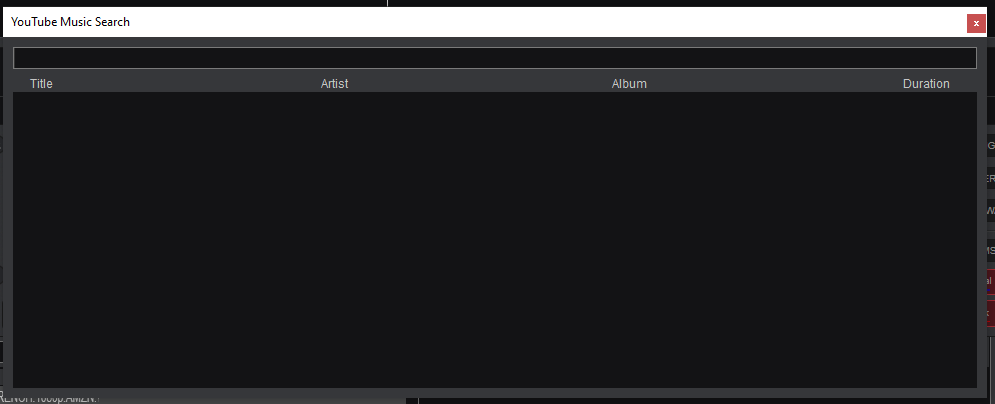

<!-- Improved compatibility of back to top link: See: https://github.com/othneildrew/Best-README-Template/pull/73 -->

<!--
*** Thanks for checking out the Best-README-Template. If you have a suggestion
*** that would make this better, please fork the repo and create a pull request
*** or simply open an issue with the tag "enhancement".
*** Don't forget to give the project a star!
*** Thanks again! Now go create something AMAZING! :D
-->

<!-- PROJECT SHIELDS -->
<!--
*** I'm using markdown "reference style" links for readability.
*** Reference links are enclosed in brackets [ ] instead of parentheses ( ).
*** See the bottom of this document for the declaration of the reference variables
*** for contributors-url, forks-url, etc. This is an optional, concise syntax you may use.
*** https://www.markdownguide.org/basic-syntax/#reference-style-links
-->

<!-- PROJECT LOGO -->
 

  

  <h3 align="center">YouTube Music for VirtualDJ</h3>

  

    Tool to download and drag and drop from YouTube Music to VirtualDJ. 
    ·
    <a href="https://github.com/Scelibre/YT-Music-VDJ/issues/new?labels=bug&template=bug-report---.md">Report Bug</a>
    ·
    <a href="https://github.com/Scelibre/YT-Music-VDJ/issues/new?labels=enhancement&template=feature-request---.md">Request Feature</a>
  

<!-- TABLE OF CONTENTS -->

  
Table of Contents

  <ol>
    <li>
      <a href="#about-the-project">About The Project</a>
      <ul>
        <li><a href="#built-with">Built With</a></li>
      </ul>
    </li>
    <li>
      <a href="#getting-started">Getting Started</a>
      <ul>
        <li><a href="#prerequisites">Prerequisites</a></li>
        <li><a href="#installation">Installation</a></li>
      </ul>
    </li>
    <li><a href="#usage">Usage</a></li>
    <li><a href="#contributing">Contributing</a></li>
    <li><a href="#license">License</a></li>
    <li><a href="#contact">Contact</a></li>
  </ol>

<!-- ABOUT THE PROJECT -->
## About The Project

Just a software to download and drag and drop directly from YouTube Music.

(<a href="#readme-top">back to top</a>)

### Built With

This section should list any major frameworks/libraries used.

* java-youtube-downloader
* mp3agic
* GSON
* Apache Commons Text
* argparse4j
* Java
* Maven
* Eclipse

(<a href="#readme-top">back to top</a>)

<!-- GETTING STARTED -->
## Getting Started

Let's build it

### Prerequisites

FFMPEG somewhere in the PATH or in the same directory of the executable (jar) : https://ffmpeg.org/download.html

Java 1.8, eclipse, maven

### Installation

0. Download FFMPEG and put it in the PATH or in the same directory of the executable (jar) : https://ffmpeg.org/download.html

Just download the last release : https://github.com/Scelibre/YT-Music-VDJ/releases/tag/PRE

OR

1. git clone https://github.com/Scelibre/YT-Music-VDJ
2. Import has maven project
3. Modify as you want and build

(<a href="#readme-top">back to top</a>)

<!-- USAGE EXAMPLES -->
## Usage

java -jar ***.jar

[-h] [-m {vdj,standalone}] [-p POSITION POSITION] -d [DIRECTORY [DIRECTORY ...]]

* -h : Help
* -m {vdj,standalone} : VDJ mode with a button to hide and show the panel, standalone juste show up the panel without button
* -p [x] [y] : Position of the button (default bottom left)
* -d [directory] : Download directory (requiered)

To exit in VDJ Mode, just quadruple right click on the button

<!-- CONTACT -->
## Contact

Scelibre : contact@scelibre.fr

(<a href="#readme-top">back to top</a>)

